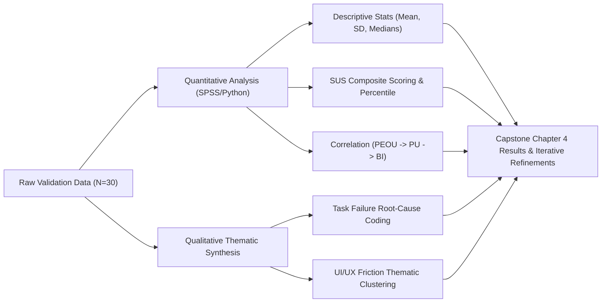

# 📋 Task Force Bruno: MVP Validation Framework & Research Plan
**Document Version:** 1.0  
**Institutional Affiliation:** Cebu Institute of Technology – University (CIT-U)  
**Project:** Task Force Bruno – Integrated Campus Pet Management System  
**Track:** Capstone 2 Research & System Validation  
**Target Sample Size:** $N = 30$ Stratified Campus Respondents  

---

## 📑 Table of Contents

1. [Executive Summary & Validation Goals](#1-executive-summary--validation-goals)
2. [Research Objectives & Evaluation Matrix](#2-research-objectives--evaluation-matrix)
3. [Selected Validation Models & Frameworks](#3-selected-validation-models--frameworks)
   - [3.1 Primary Theoretical Framework: TAM + ISO 9241-11](#31-primary-theoretical-framework-tam--iso-9241-11)
   - [3.2 Standardized Usability Instrument: SUS](#32-standardized-usability-instrument-sus)
   - [3.3 Direct Performance Measures: Task Success & Time-on-Task](#33-direct-performance-measures-task-success--time-on-task)
   - [3.4 Qualitative Inquiry: Post-Test Semi-Structured Interviews](#34-qualitative-inquiry-post-test-semi-structured-interviews)
4. [Target Respondents & Stratified Sampling Strategy](#4-target-respondents--stratified-sampling-strategy)
5. [Validation Test Scenarios & Task Protocols](#5-validation-test-scenarios--task-protocols)
   - [Cohort A: Campus Community User Test Protocol](#cohort-a-campus-community-user-test-protocol)
   - [Cohort B: MDC Staff & Clinic Admin Test Protocol](#cohort-b-mdc-staff--clinic-admin-test-protocol)
6. [Data Collection Instruments & Questionnaires](#6-data-collection-instruments--questionnaires)
   - [Instrument 1: System Usability Scale (SUS)](#instrument-1-system-usability-scale-sus)
   - [Instrument 2: Technology Acceptance Model (TAM) Survey](#instrument-2-technology-acceptance-model-tam-survey)
   - [Instrument 3: Objective Task Performance Metric Sheet](#instrument-3-objective-task-performance-metric-sheet)
   - [Instrument 4: Qualitative Post-Task Feedback Guide](#instrument-4-qualitative-post-task-feedback-guide)
7. [Measurable Success Criteria & Target Benchmarks](#7-measurable-success-criteria--target-benchmarks)
8. [Data Analysis & Statistical Methodology](#8-data-analysis--statistical-methodology)
9. [Validation Execution Roadmap](#9-validation-execution-roadmap)
10. [Adviser Consultation & Sign-Off Checklist](#10-adviser-consultation--sign-off-checklist)

---

## 1. Executive Summary & Validation Goals

The primary objective of the **Task Force Bruno MVP Validation** is to systematically evaluate the usefulness, usability, operational efficiency, user experience, and institutional acceptance of the deployed campus pet management platform at **Cebu Institute of Technology – University (CIT-U)**.

Rather than merely verifying that the software functions without syntax errors, this validation study gathers empirical quantitative and qualitative evidence to prove that:
1. The system effectively mitigates stray identification delays and streamlines animal welfare operations across campus.
2. The dual-card optical QR scanner and AI-driven trait search engine allow rapid, accurate lookups.
3. The digitized clinical timeline, vaccination journal, and adoption pipeline improve institutional coordination over legacy manual logging.
4. Both general campus community members (students, faculty) and administrative operators (MDC staff, campus clinic handlers) are willing to adopt and sustain the system long-term.

---

## 2. Research Objectives & Evaluation Matrix

The evaluation aligns Capstone research questions with established scientific frameworks, measurable metrics, and concrete instruments:

| Research Question | Evaluation Dimension | Proposed Model / Framework | Target Metric | Data Instrument |
| :--- | :--- | :--- | :--- | :--- |
| **RQ1: Usability** | How easy and intuitive is the interface for campus users and staff? | **ISO 9241-11 & System Usability Scale (SUS)** | SUS Score $\ge 75/100$; Perceived Ease of Use $\ge 4.0/5.0$ | Standardized 10-Item SUS Questionnaire |
| **RQ2: Effectiveness** | Can users accurately identify animals, log sightings, and process records without errors? | **Goal-Question-Metric (GQM) & Task Success Rate** | $\ge 90\%$ Task Completion Rate with 0 critical errors | Moderated Task Protocol Observation Sheet |
| **RQ3: Efficiency** | Does the system reduce the time required to perform animal identification, sighting triage, and inventory logging? | **ISO 9241-11 Efficiency & Time-on-Task** | Benchmark reduction against baseline manual processes ($< 45\text{s}$ per lookup) | Stopwatch / System Event Timestamp Logging |
| **RQ4: Usefulness** | Does the system solve real campus animal welfare, TNR tracking, and rabies risk management challenges? | **Technology Acceptance Model (TAM)** | Perceived Usefulness (PU) mean score $\ge 4.2 / 5.0$ | TAM 7-Point Likert Instrument |
| **RQ5: User Acceptance** | Are CIT-U stakeholders willing to adopt and actively use the platform in their daily campus routine? | **TAM (Behavioral Intention) & UAT** | Behavioral Intention to Use (BI) $\ge 85\%$ positive sentiment | TAM Survey + Semi-Structured User Interviews |
| **RQ6: UX & Reliability** | How do users perceive visual clarity, navigation hierarchy, responsive layout, and session security? | **User Acceptance Testing (UAT) & Heuristic Review** | Zero critical blocking UI bugs; $> 80\%$ satisfaction rating | Post-Study Feedback Questionnaire |

---

## 3. Selected Validation Models & Frameworks

To obtain a robust and scientifically defensible evaluation for Capstone 2, a **Multi-Method Hybrid Approach** is employed:

```
+-------------------------------------------------------------------------+
|                  PRIMARY FRAMEWORK: TAM + ISO 9241-11                   |
|   (Perceived Usefulness, Perceived Ease of Use, Efficiency, Satisfaction)   |
+------------------------------------+------------------------------------+
                                     |
         +---------------------------+---------------------------+
         |                                                       |
+--------v----------------------+               +----------------v----------------------+
|     QUANTITATIVE MEASURES     |               |     QUALITATIVE & OBSERVATIONAL       |
| • System Usability Scale (SUS)|               | • Cognitive Walkthrough Notes         |
| • Task Success Rate (%)       |               | • Post-Study Semi-Structured Interview|
| • Time-on-Task (Seconds)      |               | • User Acceptance Testing (UAT) Logs  |
+-------------------------------+               +---------------------------------------+
```

### 3.1 Primary Theoretical Framework: TAM + ISO 9241-11
- **Technology Acceptance Model (TAM):** Evaluates core psychological constructs influencing technology adoption in educational institutions:
  - *Perceived Usefulness (PU):* Degree to which the user believes Task Force Bruno enhances campus pet care and safety.
  - *Perceived Ease of Use (PEOU):* Degree to which users find navigation, scanning, and forms effortless.
  - *Attitude Towards Using (ATU):* User sentiment regarding the institutional rollout.
  - *Behavioral Intention to Use (BI):* Likelihood of recurring engagement (reporting sightings, checking newsfeed, adopting).
- **ISO 9241-11:** Measures usability across three pillars:
  - *Effectiveness:* Accuracy and completeness with which users achieve specific goals.
  - *Efficiency:* Resources expended (time, effort) in relation to the accuracy of results.
  - *Satisfaction:* Freedom from discomfort and positive attitudes towards the use of the product.

### 3.2 Standardized Usability Instrument: SUS
The **System Usability Scale (SUS)** provides an industry-standard, technology-independent composite usability score (0–100) across 10 alternating positive and negative statements.

### 3.3 Direct Performance Measures: Task Success & Time-on-Task
Objective behavioral data captured during moderated user testing:
- **Binary Task Completion:** Scored as $1$ (Success without assistance), $0.5$ (Success with minor prompt), or $0$ (Failed / Abandoned).
- **Time-on-Task (ToT):** Recorded in seconds from task initiation to final submission.

### 3.4 Qualitative Inquiry: Post-Test Semi-Structured Interviews
Gathers rich narrative feedback on edge cases, visual layout issues, suggested features, and emotional responses to animal profiles.

---

## 4. Target Respondents & Stratified Sampling Strategy

A total sample size of **$N = 30$ participants** from the **Cebu Institute of Technology – University** ecosystem will participate in the MVP validation, stratified across key institutional roles:

```
               Total Validation Cohort (N = 30)
              ┌────────────────────────────────┐
              │                                │
      Cohort A: Community              Cohort B: Institutional
     Campus Users (n = 22)               Staff & Admins (n = 8)
    ┌───────────────────────┐        ┌─────────────────────────┐
    │ • 14 College Students │        │ • 3 MDC Staff Members   │
    │ • 4 Faculty Members   │        │ • 2 Clinic/Vet Handlers │
    │ • 4 Non-Teaching Staff│        │ • 3 Animal Org Officers │
    └───────────────────────┘        └─────────────────────────┘
```

### Inclusion Criteria:
1. **Cohort A (General Community):** Active CIT-U student, faculty, or staff member with an official `@cit.edu` email and institutional ID.
2. **Cohort B (Staff / Operators):** Designated campus marshals, Medical-Dental Clinic (MDC) personnel, animal welfare organization leaders, or capstone administrators with administrative clearance.

---

## 5. Validation Test Scenarios & Task Protocols

### Cohort A: Campus Community User Test Protocol (Tasks 1–5)

| Task ID | Task Name | Scenario / Prompt | Expected Result | Max Time Allowed |
| :--- | :--- | :--- | :--- | :--- |
| **TS-A1** | **Institutional Registration & Authentication** | *"Register a new account using your `@cit.edu` email and student ID format (`XX-XXXX-XXX`), then log in to the portal."* | Account registered in Supabase, session created, landed on Community Dashboard. | 60 seconds |
| **TS-A2** | **Collar QR Scanner Lookup** | *"Use the Collar QR Scanner module to scan a provided sample pet QR tag (`PET-0001` or upload image matrix) to retrieve profile details."* | Scanner resolves QR via `jsQR`, loads pet demographics, immunization status, and rescue history. | 45 seconds |
| **TS-A3** | **AI Trait Natural Language Search** | *"Use the AI Trait Search engine to find an animal with physical descriptors: 'calico coat with white socks near library'."* | NLP token search matches candidate records descending by relevance score. | 30 seconds |
| **TS-A4** | **Submit Animal Sighting Report** | *"Report a stray animal sighting near the Gymnasium by entering the location description and attaching a photo."* | Sighting stored in Supabase with location tag, timestamp, and uploaded image. | 75 seconds |
| **TS-A5** | **Browse & Submit Adoption Form** | *"Navigate to the Adoption Placement Portal, select an adoptable companion, and submit an adoption inquiry form."* | Application logged with applicant metadata, status set to `Pending`. | 90 seconds |

---

### Cohort B: MDC Staff & Clinic Admin Test Protocol (Tasks 6–10)

| Task ID | Task Name | Scenario / Prompt | Expected Result | Max Time Allowed |
| :--- | :--- | :--- | :--- | :--- |
| **TS-B1** | **New Animal Intake Registration** | *"Register a newly rescued stray into the system with full biometrics, TNR status, and multi-part photo upload."* | Pet record created, unique ID generated, visual asset stored in Supabase `petpictures` bucket. | 120 seconds |
| **TS-B2** | **Sighting Report Triage & Validation** | *"Review pending community sighting submissions, verify photographic evidence, and approve/escalate the report."* | Sighting status updated to `Verified` / `Triaged` in real time. | 45 seconds |
| **TS-B3** | **Clinical Record & Vaccine Journaling** | *"Add a veterinary diagnosis log and an anti-rabies vaccination entry with automated due date for companion 'Bruno'."* | Medical record and vaccination log appended to pet's longitudinal health timeline. | 60 seconds |
| **TS-B4** | **Adoption Application Review & Triage** | *"Inspect a pending adoption application, evaluate applicant details, and approve the adoption with status transition."* | Application marked as `Approved`, animal category updated to `Adopted Alumni`. | 60 seconds |
| **TS-B5** | **Supply Inventory Ledger Adjustment** | *"Record an incoming donation of 10 cat food packs in the Warehouse Supply Hub with donor remarks."* | Inventory stock incremented, audit ledger entry created with staff signature. | 45 seconds |

---

## 6. Data Collection Instruments & Questionnaires

### Instrument 1: System Usability Scale (SUS)
*(Scored on a 5-point Likert Scale: 1 = Strongly Disagree, 5 = Strongly Agree)*

```markdown
1. I think that I would like to use Task Force Bruno frequently.
2. I found the system unnecessarily complex.
3. I thought the system was easy to use.
4. I think that I would need the support of a technical person to be able to use this system.
5. I found the various functions in this system were well integrated.
6. I thought there was too much inconsistency in this system.
7. I would imagine that most people would learn to use this system very quickly.
8. I found the system very cumbersome to use.
9. I felt very confident using the system.
10. I needed to learn a lot of things before I could get going with this system.
```

> **SUS Calculation Formula:**  
> For odd items $(1, 3, 5, 7, 9)$: $\text{Score} = \text{Response} - 1$  
> For even items $(2, 4, 6, 8, 10)$: $\text{Score} = 5 - \text{Response}$  
> $\text{Composite SUS Score} = \left(\sum \text{Scores}\right) \times 2.5$ (Yields a benchmark score out of 100).

---

### Instrument 2: Technology Acceptance Model (TAM) Survey
*(Scored on a 7-point Likert Scale: 1 = Strongly Disagree to 7 = Strongly Agree)*

#### A. Perceived Usefulness (PU)
- **PU1:** Using Task Force Bruno makes identifying campus animals significantly faster.
- **PU2:** The system improves the transparency and record-keeping of campus vaccination and TNR programs.
- **PU3:** The sighting triage and adoption modules enhance community involvement in animal safety.
- **PU4:** Overall, I find Task Force Bruno useful for the CIT-U campus ecosystem.

#### B. Perceived Ease of Use (PEOU)
- **PEOU1:** Learning to operate the QR scanner and search features is easy for me.
- **PEOU2:** My interaction with the system is clear and understandable.
- **PEOU3:** It is easy to submit sighting reports, applications, and browse animal profiles.
- **PEOU4:** I find the user interface intuitive, responsive, and easy to navigate.

#### C. Attitude Toward Using (ATU)
- **ATU1:** Using Task Force Bruno is a positive initiative for CIT-U animal welfare.
- **ATU2:** Managing campus pets digitally is far superior to manual paper logs or uncoordinated chat groups.

#### D. Behavioral Intention to Use (BI)
- **BI1:** I intend to use Task Force Bruno whenever I encounter a stray or resident pet on campus.
- **BI2:** I would recommend Task Force Bruno to fellow CIT-U students, faculty, and colleagues.

---

### Instrument 3: Objective Task Performance Metric Sheet

```
Participant ID: _________   Cohort: [ ] Community   [ ] Staff
Date: __________________   Facilitator: ______________________

+---------+--------------------------+---------------------+-------------------+---------------------+
| Task ID | Task Description         | Success (1/0.5/0)   | Time-on-Task (s)  | Errors / Notes      |
+---------+--------------------------+---------------------+-------------------+---------------------+
| TS-01   | Registration & Login     | [ ] 1  [ ] 0.5 [ ] 0| ________ seconds  |                     |
| TS-02   | Optical QR Scanner       | [ ] 1  [ ] 0.5 [ ] 0| ________ seconds  |                     |
| TS-03   | AI NLP Trait Search      | [ ] 1  [ ] 0.5 [ ] 0| ________ seconds  |                     |
| TS-04   | Sighting Submission      | [ ] 1  [ ] 0.5 [ ] 0| ________ seconds  |                     |
| TS-05   | Adoption / Admin Action  | [ ] 1  [ ] 0.5 [ ] 0| ________ seconds  |                     |
+---------+--------------------------+---------------------+-------------------+---------------------+
```

---

### Instrument 4: Qualitative Post-Task Feedback Guide

1. *What specific feature did you find most helpful during your interaction with the system?*
2. *Did you encounter any confusing layouts, terminology, or navigation roadblocks?*
3. *How effective was the QR scanner / AI search in retrieving the animal profile you were looking for?*
4. *What additional features or adjustments would you recommend before campus-wide deployment?*

---

## 7. Measurable Success Criteria & Target Benchmarks

| Metric / Parameter | Minimum Threshold | Target Benchmark | Outcome Interpretation |
| :--- | :--- | :--- | :--- |
| **System Usability Scale (SUS)** | $\ge 68.0$ (Industry Average) | **$\ge 75.0$ (Grade A - Good to Excellent)** | High user satisfaction and minimal friction. |
| **Task Success Rate (TSR)** | $\ge 80.0\%$ | **$\ge 90.0\%$ Completed Tasks** | System is operationally effective for non-technical users. |
| **Mean Time-on-Task (QR Scan)** | $\le 60\text{ seconds}$ | **$\le 25\text{ seconds}$** | Optical decoding and lookup is rapid and responsive. |
| **Mean Time-on-Task (Sighting Log)** | $\le 120\text{ seconds}$ | **$\le 60\text{ seconds}$** | Community reporting friction is sufficiently low. |
| **Perceived Usefulness (TAM-PU)** | $\ge 3.5 / 5.0$ | **$\ge 4.2 / 5.0$ (Positive)** | Strong institutional relevance and perceived utility. |
| **Perceived Ease of Use (TAM-PEOU)**| $\ge 3.5 / 5.0$ | **$\ge 4.0 / 5.0$ (Positive)** | High learnability and interface clarity. |
| **Behavioral Intention (TAM-BI)** | $\ge 70.0\%$ Agree | **$\ge 85.0\%$ Positive Intent** | High likelihood of sustained campus-wide adoption. |

---

## 8. Data Analysis & Statistical Methodology



1. **Descriptive Statistics:** Calculate Mean, Standard Deviation ($SD$), and Median scores for each SUS item and TAM construct.
2. **Cronbach's Alpha Reliability:** Test internal consistency across TAM survey items (Target $\alpha \ge 0.70$).
3. **Correlation Analysis:** Pearson's $r$ to assess relationships between Perceived Ease of Use ($PEOU$) and Behavioral Intention ($BI$).
4. **Thematic Qualitative Coding:** Group user remarks into categories: *UI Ergonomics*, *Search Accuracy*, *Mobile Viewport Performance*, and *Feature Requests*.

---

## 9. Validation Execution Roadmap

```
+-----------------------------------------------------------------------------------+
|                           MVP VALIDATION TIMELINE                                 |
+-------------------+---------------------------------------+-----------------------+
| Phase             | Key Activities                        | Deliverables          |
+-------------------+---------------------------------------+-----------------------+
| Phase 1: Prep     | • Finalize test instruments & forms   | Approved Protocol &   |
| (Days 1–3)        | • Deploy stable production build      | Seed Data Ready       |
|                   | • Seed sample pets & QR test tags     |                       |
+-------------------+---------------------------------------+-----------------------+
| Phase 2: Testing  | • Conduct 30 user test sessions       | Completed Sheets,     |
| (Days 4–8)        | • Cohort A (Community, n=22)          | SUS Submissions &     |
|                   | • Cohort B (Staff/MDC, n=8)           | Interview Audio/Notes |
+-------------------+---------------------------------------+-----------------------+
| Phase 3: Analysis | • Compute SUS & TAM aggregates        | Statistical Charts &  |
| (Days 9–11)       | • Analyze Time-on-Task & Success Rates| Metric Summaries      |
+-------------------+---------------------------------------+-----------------------+
| Phase 4: Report   | • Draft Chapter 4 (Results & Findings)| Capstone Validation   |
| (Days 12–14)      | • Implement critical UX bug fixes     | Chapter & Slide Deck  |
+-------------------+---------------------------------------+-----------------------+
```

---

## 10. Adviser Consultation & Sign-Off Checklist

Before running test sessions with respondents, review and confirm the following items with your Capstone Adviser:

- [ ] **Validation Model Approval:** Adviser agreement on the hybrid **TAM + ISO 9241-11 + SUS** approach.
- [ ] **Respondent Stratification:** Verification of the $N=30$ breakdown ($22$ Community vs $8$ Staff).
- [ ] **Instrument Appropriateness:** Review of the 10-item SUS and 12-item TAM questionnaires.
- [ ] **Data Privacy & Ethics Compliance:** Assured compliance with CIT-U student data guidelines and anonymous handling of evaluation responses.
- [ ] **Live System Readiness:** Production deployment on Vercel/Render verified with active Supabase connectivity.

---

<div align="center">

**Task Force Bruno Engineering & Research Team**  
*Cebu Institute of Technology – University (CIT-U)*  
*Department of Information Technology — Capstone 2*

</div>
